# (C# 코딩) BurgerKiosk (버거 주문 키오스크)

## 개요
- C# 프로그래밍학습
- 1줄소개: 키보드와 마우스를 이용해 메뉴를 선택하고 주문할 수 있는 버거 주문 키오스크
- 사용한 플랫폼: 
    - C#, .NET Windows Forms, Visual Studio, GitHub
- 사용한 컨트롤:
    - Label, RadioButton, CheckBox, Button, GroupBox, ListBox
- 사용한 기술과 구현한 기능:
    - Visual Studio를 이용하여 UI 디자인
    - `Click` `CheckedChanged` 등 이벤트 기반 프로그래밍
    - 선택 항목에 따른 가격 계산 기능 구현
    - 키보드 입력을 통한 UI 제어 기능 구현

## 실행 화면 (과제1)
- 과제 1코드의 실행 스크린샷

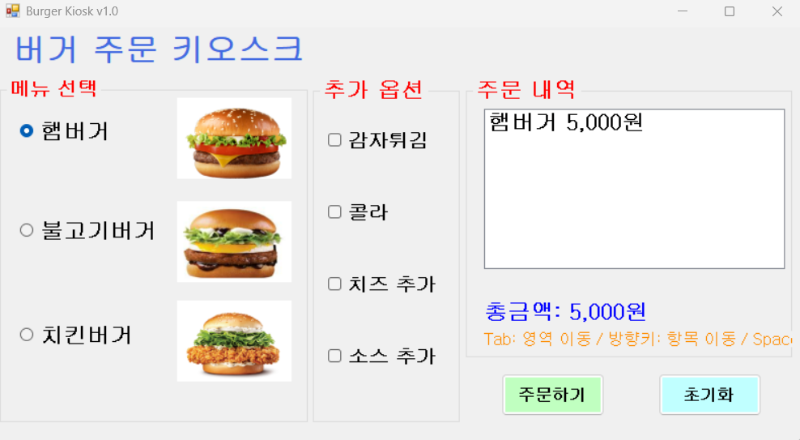
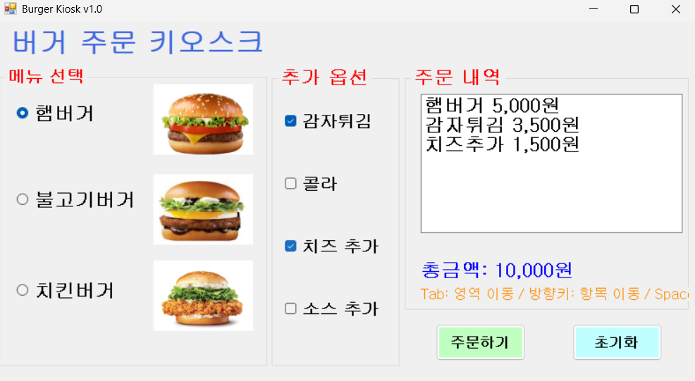
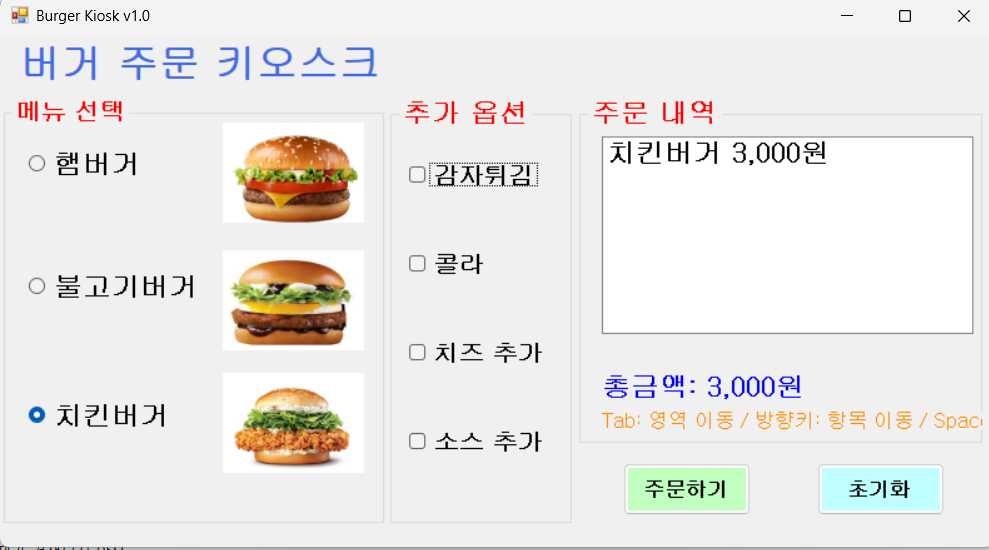
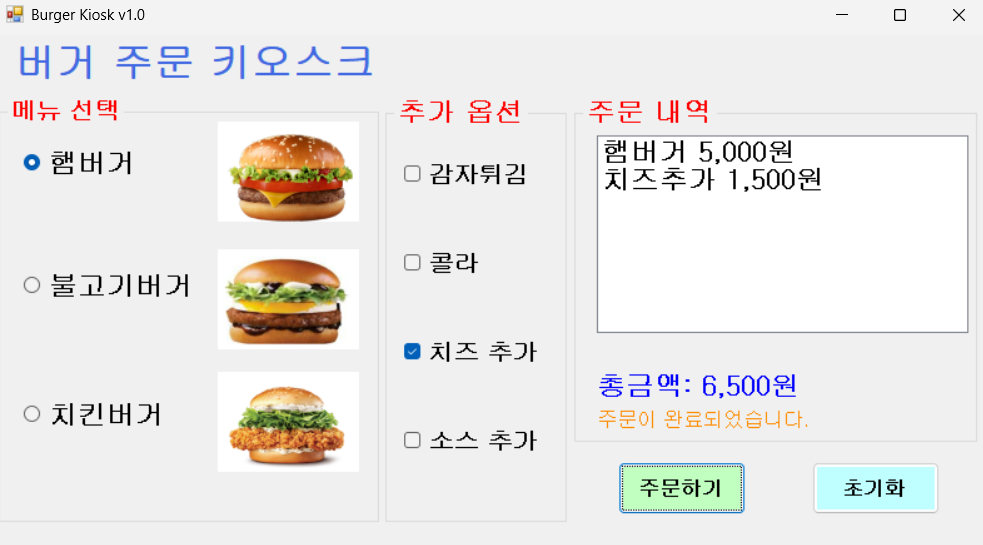

- 과제내용
    - `RadioButton`과 `CheckBox`를 이용한 메뉴 선택 UI 구성
    - `GroupBox`를 활용하여 메뉴 그룹화
    - 주문하기 버튼과 초기화 버튼 구현
    - 선택된 메뉴를 기반으로 주문내역 및 총금액 출력

- 구현 내용과 기능 설명
    - 햄버거 메뉴는 `RadioButton`으로 구성하여 1개만 선택 가능하도록 설정
    - 사이드 및 음료는 `CheckBox`로 구성하여 복수 선택 가능하도록 구현하였습니다.
    - 주문하기 버튼 클릭 시 선택된 메뉴를 `ListBox`에 출력
    - 초기화 버튼 클릭 시 모든 선택 및 결과를 초기화하는 기능을 구현하여 편의성을 높였습니다.

## 실행 화면 (과제2)
- 과제 2코드의 실행 스크린샷

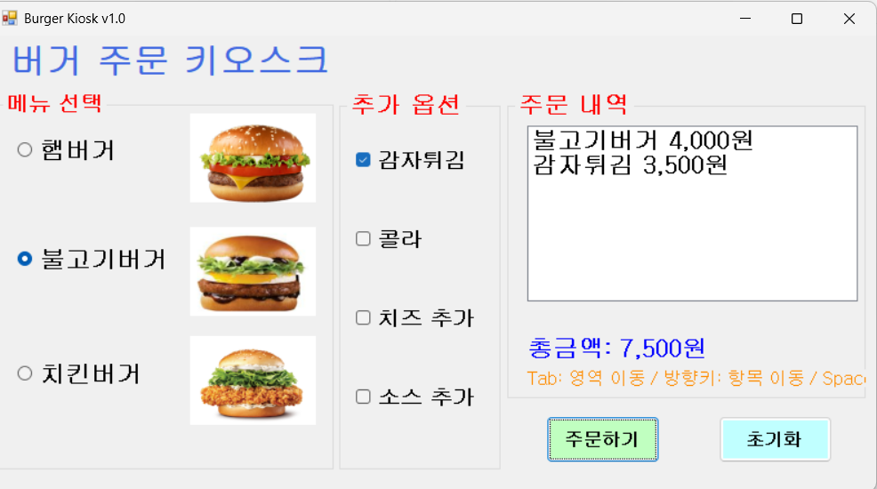
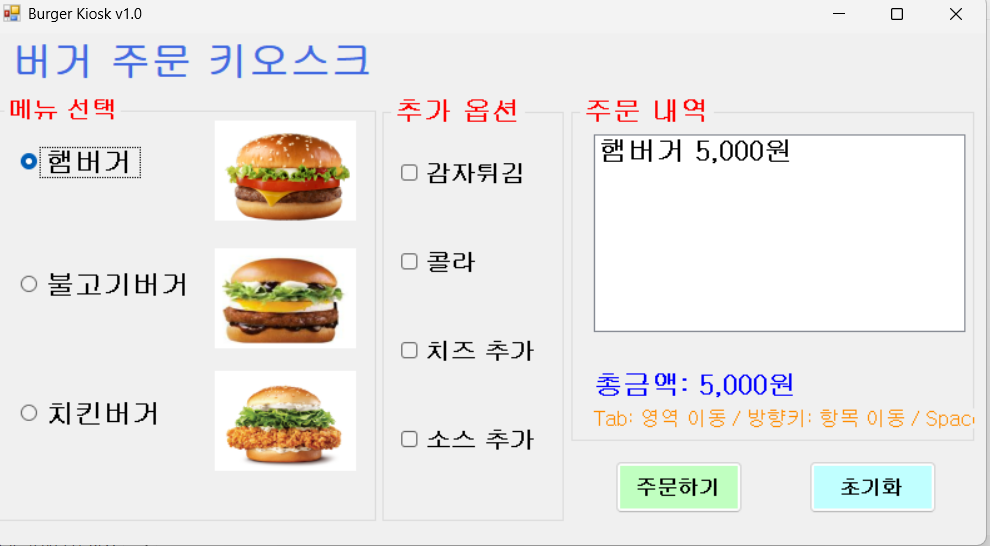
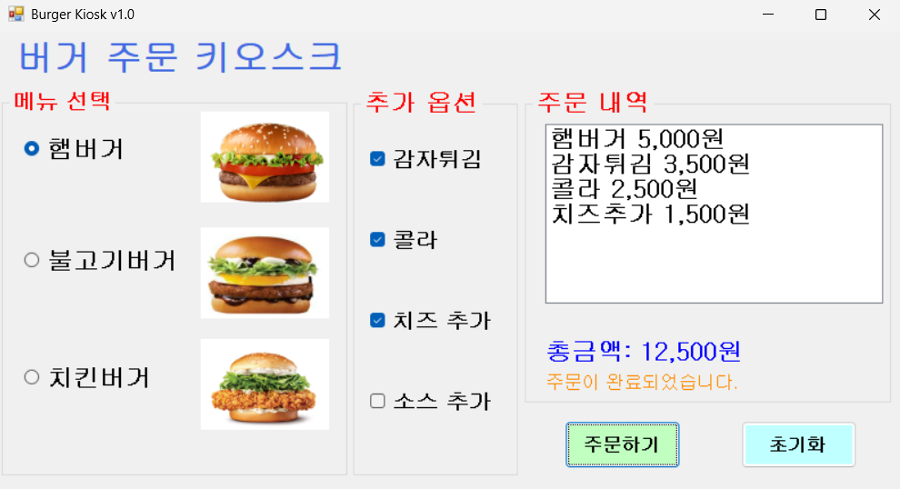
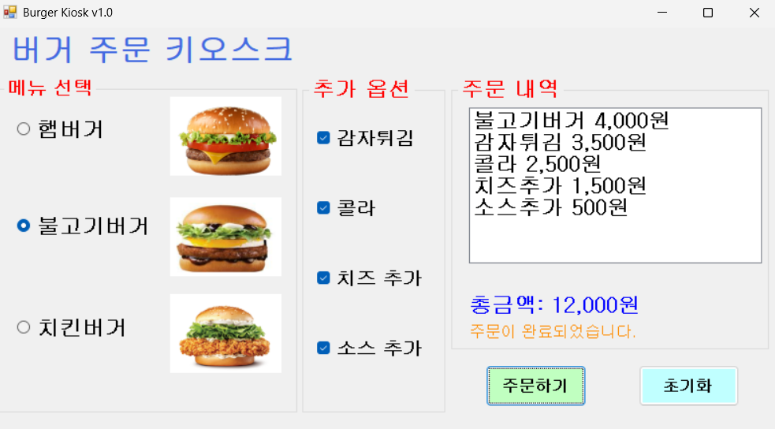

- 과제내용
    - 아무것도 선택하지 않고 주문 시 에러 메시지 표시기능.
    - `MessageBox` 대신 `Label`을 활용한 사용자 피드백 구현하기

- 구현 내용과 기능 설명
    - 주문하기 버튼 클릭 시 선택 여부를 확인하기
    - 선택된 항목이 없을 경우 `Label`에 에러 메시지 출력을 하였습니다.
    - 사용자의 경험을 고려하여 직관적인 위치에 메시지를 표시하였습니다.

## 실행 화면 (과제3)
- 과제 3코드의 실행 스크린샷 

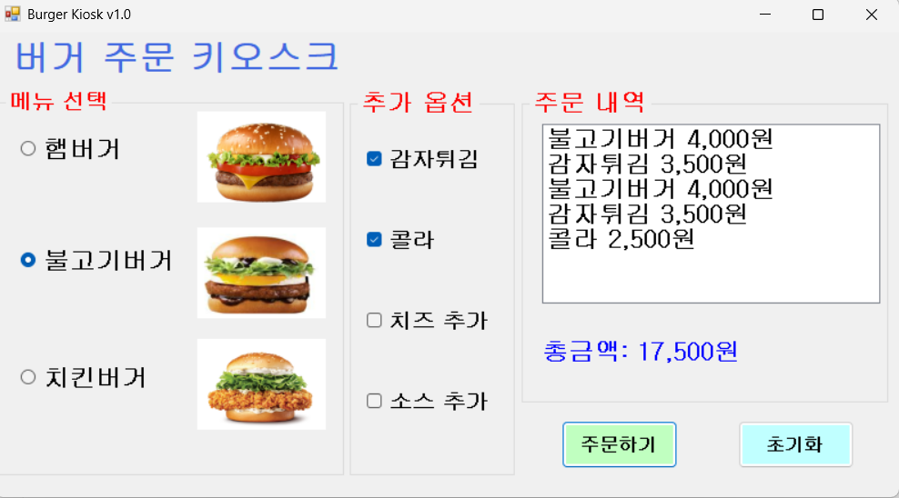
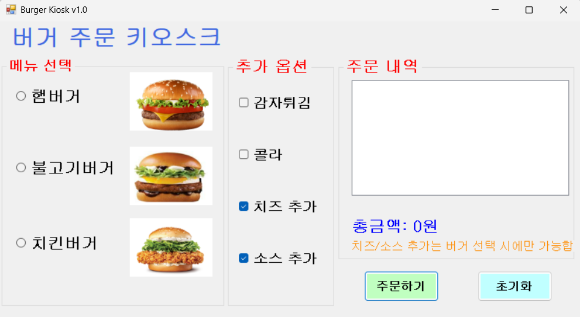
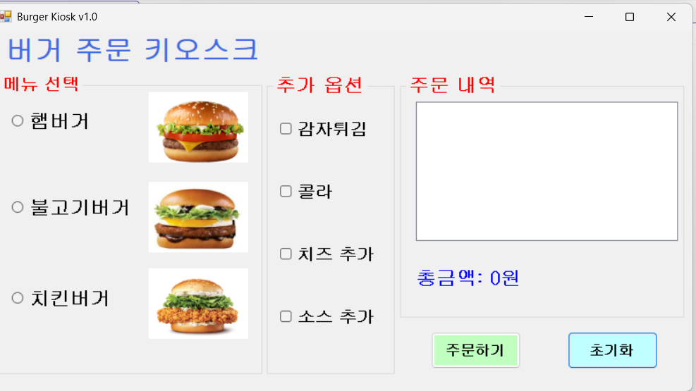
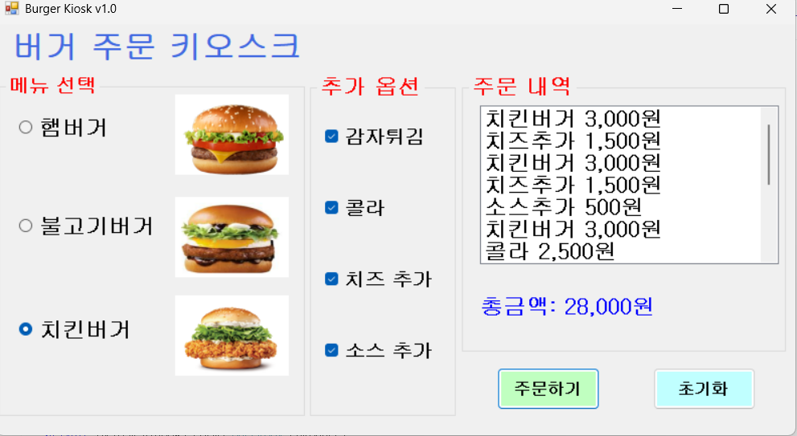

- 과제내용
    - 키보드만으로 주문이 가능하도록 기능 구현으로 사용자 편의성 향상
    - Tab 키를 이용한 `GroupBox` 간 이동
    - Space 키로 선택/해제, Enter 키로 버튼 실행

- 구현 내용과 기능 설명
    - TabIndex를 설정하여 자연스러운 포커스 이동 구현
    - `RadioButton` 및 `CheckBox`의 키보드 입력 처리
    - Enter 키 입력 시 주문 버튼 이벤트가 설정 되도록 마우스 없이 기능 사용구현

## 실행 화면 (과제4)
- 과제 4코드의 실행 스크린샷 

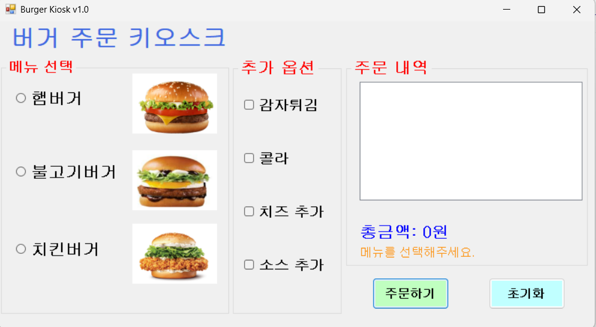
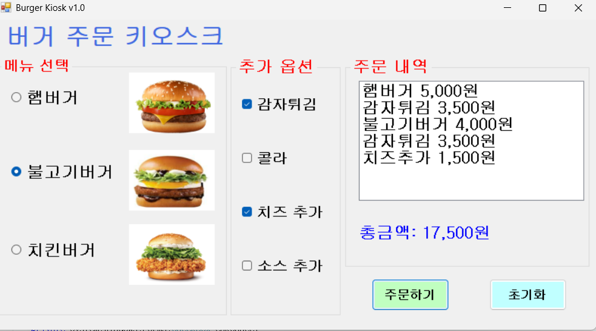
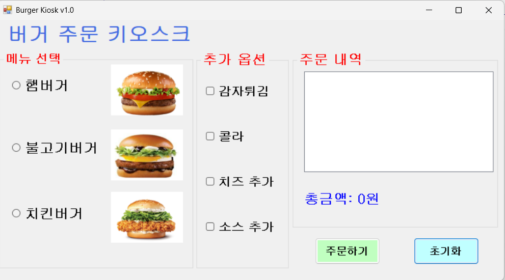
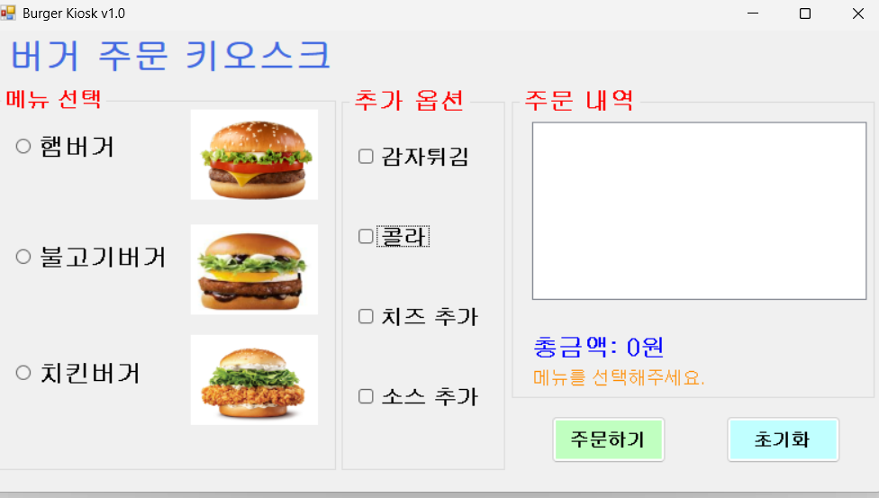

- 과제내용
    - 메뉴 선택 즉시 주문 정보 실시간 갱신
    - `ListBox`와 `Label`을 통한 실시간 피드백 제공

- 구현 내용과 기능 설명
    - `RadioButton`과 `CheckBox`의 CheckedChanged 이벤트 활용
    - 선택 시 즉시 `ListBox`에 주문 내역 추가 및 갱신 기능
    - 총 금액을 실시간으로 계산하여 `Label`에 표시하며 사용자가 직관적으로 확인하도록 구현하였습니다.